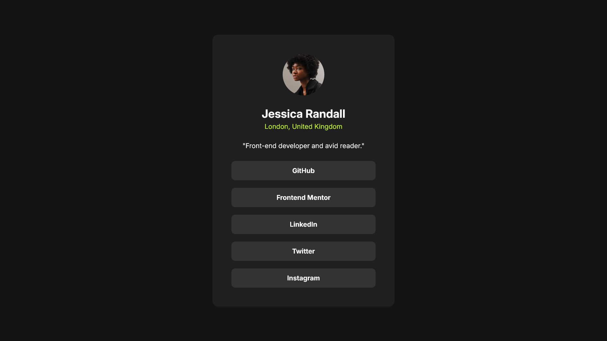

# Frontend Mentor - Social links profile solution

This is a solution to the [Social links profile challenge on Frontend Mentor](https://www.frontendmentor.io/challenges/social-links-profile-UG32l9m6dQ). Frontend Mentor challenges help you improve your coding skills by building realistic projects. 

## Table of contents

- [Overview](#overview)
  - [The challenge](#the-challenge)
  - [Screenshot](#screenshot)
  - [Links](#links)
- [My process](#my-process)
  - [Built with](#built-with)
  - [What I learned](#what-i-learned)
  - [Continued development](#continued-development)
- [Author](#author)

## Overview

### The challenge

Users should be able to:

- See hover and focus states for all interactive elements on the page

### Screenshot

### Links

- Solution URL: [Add solution URL here](https://github.com/vishpant76/social-links-profile)
- Live Site URL: [Add live site URL here](https://vishpant76.github.io/social-links-profile/)

## My process

### Built with

- Semantic HTML5 markup
- Flexbox
- CSS

### What I learned

More practice working with flexbox, link tags, dealing with hover and active states, and studying the figma design files to get an accurate judgement of the styles, colors, and layout.

### Continued development

Need to put more work on using flexbox and its different properties. Still have used only a fraction of its capabilities, and I continue to get stumped when the page starts misbehaving due to a minor change in the css, which then takes me a while to figure out why it's happening.

## Author

- Frontend Mentor - [@vishpant76](https://www.frontendmentor.io/profile/vishpant76)
